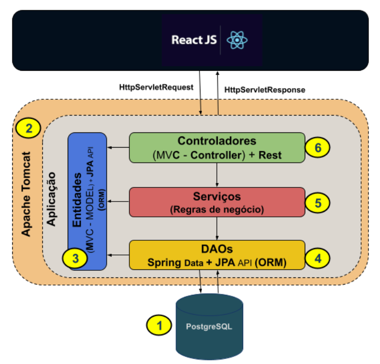
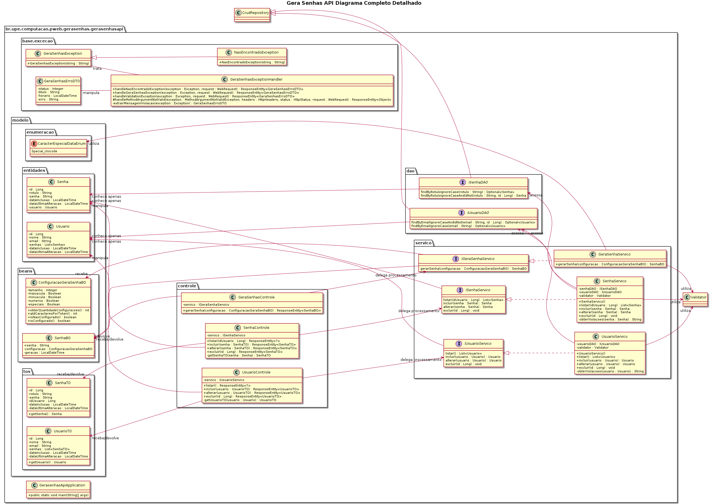

<h1 align="center"> 
[Construindo uma API Rest com Java]
</h1>
<h4 align="center"> 
    Universidade de Pernambuco | Campus Garanhuns | Coordenação de Computação
</h4>
<h4 align="center"> 
 🚧 Vamos construir uma API Rest para o front do app Gera Senha 🚀 🚧
</h4>
<p align="center">
  

  
  <a href="https://github.com/helaine-barreiros/pweb-2021.2-api/commits/master">
    
  </a>

  
   <a href="https://github.com/helaine-barreiros/pweb-2021.2-api/stargazers">
    
  </a>
</p>

## 🏦 Sobre o projeto

O <b>Gera Senhas</b> é uma aplicação capaz de gerar senhas fortes, com base nas configurações de diretrizes estabelecidas pelo usuário. A geração de senhas fortes as tornam difíceis de serem lembradas e um gerenciador torna mais fácil o trabalho de armazenar, identificar e recuperar estas senhas.

Após a análise de algumas opções existentes, definimos a seguinte lista de requisitos:

- <b>[RF01]</b> - Quantidade de caracteres - define a quantidade de caracteres (Essencial)
- <b>[RF02]</b> - Letra maiúscula - define a presença de caracteres alfabéticos maiúsculos (Essencial)
- <b>[RF03]</b> - Letra minúscula - define a presença de caracteres - minúsculos (Essencial)
- <b>[RF04]</b> - Números - define a presença de caracteres minúsculos (Essencial)
- <b>[RF05]</b> - Símbolos - define a presença de caracteres especiais(!@#$%&\*()-+.,;?{[}]^><:) (Essencial)
- <b>[RF06]</b> - Caracteres semelhantes - define a possibilidade da senha gerada conter repetição de caracteres (Desejável)
- <b>[RF07]</b> - Copiar - possibilita a cópia da senha para a área de clipboard (Importante)
- <b>[RF08]</b> - Compartilhamento - permite ompartilhar a senha gerada via whatsapp ou email (Desejável)
- <b>[RF09]</b> - Armazenamento - permite armazenar a senha (Importante)
- <b>[RF10]</b> - Categorização de senhas - permite organizar as senhas armazenadas aplicando labels (Desejável)
- <b>[RF11]</b> - Criptografia - permite que a senha armazenada seja criptografada (Desejável)

Os usuários terão acesso às funcionalidades através da API rest e da interface de usuário construida em ReactJS.

<h1 align="center">
    
</h1>

Projeto é desenvolvido durante a disciplina de **Programação Web** do curso de Bacharelado em Engenharia de Software da [Universidade de Pernambuco - Campus Garanhuns].

A disciplina propõe uma vivência prática nos desafios de aprender a programar para web utilizando a linguagem Java com o framework Spring Boot e interface de usuário em ReactJS.

## 🚀 Objetivo

Vivenciar a experiência de construir uma aplicação backend que provê uma API Rest utilizando as melhores práticas do Spring Boot

## 💻 Tecnologias

As seguintes ferramentas são usadas na construção da API:

- [Java]
- [Spring Boot]
- [Spring Data]
- [Spring Validation]
- [Spring Web]
- [Lombok]
- [PostgreSQL]
- [Apache Tomcat]
- [Spring HATEOAS]

## 🛠 Feramentas

- Git
- Java Virtual Machine 8
- Maven 3.6.3
- Eclipse IDE ou Visual Studio Code
- Spring Tool Suite 4 (plugin)
- Postgre SQL

## 🌉 Arquitetura de referência

<p align="center">
    
</p>

## 🌉 Diagrama de Classes

<p align="center">
    
</p>

## 🚧 Welcome Kit

Consulte o [welcome kit](./assets/Welcome_Kit_PWEB-2021.2_v1.pdf) para orientações sobre a disciplina, ferramentas e configuração de ambiente.

## 🚀 Como executar o projeto

```bash
#Clone este repositório
$ git clone https://github.com/helaine-barreiros/pweb-2021.2-api

#Acesse a pasta do projeto no terminal/cmd
$ cd piii-api

#Execute a instalação do projeto
$ mvn clean install

#Execute a aplicação em modo de desenvolvimento
$ java -jar /target/gera-senha-api.jar

#O servidor inciará na porta:8080 - acesse http://localhost:8080
```

## 📑 Documentações de Referência

- [Official Apache Maven documentation](https://maven.apache.org/guides/index.html)
- [Spring Boot Maven Plugin Reference Guide](https://docs.spring.io/spring-boot/docs/2.6.1/maven-plugin/reference/html/)
- [Create an OCI image](https://docs.spring.io/spring-boot/docs/2.6.1/maven-plugin/reference/html/#build-image)
- [Spring HATEOAS](https://docs.spring.io/spring-boot/docs/2.6.1/reference/htmlsingle/#boot-features-spring-hateoas)
- [Spring Data JPA](https://docs.spring.io/spring-boot/docs/2.6.1/reference/htmlsingle/#boot-features-jpa-and-spring-data)
- [Spring Boot DevTools](https://docs.spring.io/spring-boot/docs/2.6.1/reference/htmlsingle/#using-boot-devtools)
- [Spring Web](https://docs.spring.io/spring-boot/docs/2.6.1/reference/htmlsingle/#boot-features-developing-web-applications)
- [Validation](https://docs.spring.io/spring-boot/docs/2.6.1/reference/htmlsingle/#boot-features-validation)

### 📘 Guias

- [Building a Hypermedia-Driven RESTful Web Service](https://spring.io/guides/gs/rest-hateoas/)
- [Accessing Data with JPA](https://spring.io/guides/gs/accessing-data-jpa/)
- [Building a RESTful Web Service](https://spring.io/guides/gs/rest-service/)
- [Serving Web Content with Spring MVC](https://spring.io/guides/gs/serving-web-content/)
- [Building REST services with Spring](https://spring.io/guides/tutorials/bookmarks/)

## 👤 Como contribuir para o projeto

1. Faça um **fork** do projeto.
2. Crie uma nova branch com as suas alterações: `git checkout -b my-feature`
3. Salve as alterações e crie uma mensagem de commit contando o que você fez: `git commit -m "feature: My new feature"`
4. Envie as suas alterações: `git push origin my-feature`
   > Caso tenha alguma dúvida confira este [guia de como contribuir no GitHub](https://github.com/firstcontributions/first-contributions)

## 📜 Licença

Apache 2.0

Copyright (c) [2021] [Helaine Barreiros]

---

## Autor

Feito com ❤️ por Helaine Barreiros 👋🏽 [Entre em contato!](mailto:helaine.lins@upe.br)

- Twitter - [@hbarreiros\_](https://twitter.com/hbarreiros_)

[Voltar](#estrutura)
